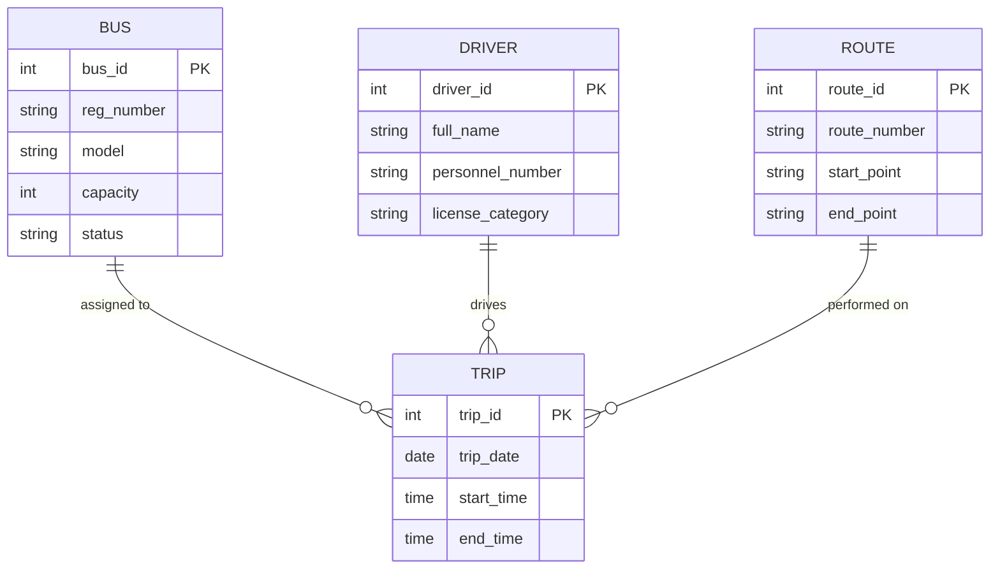
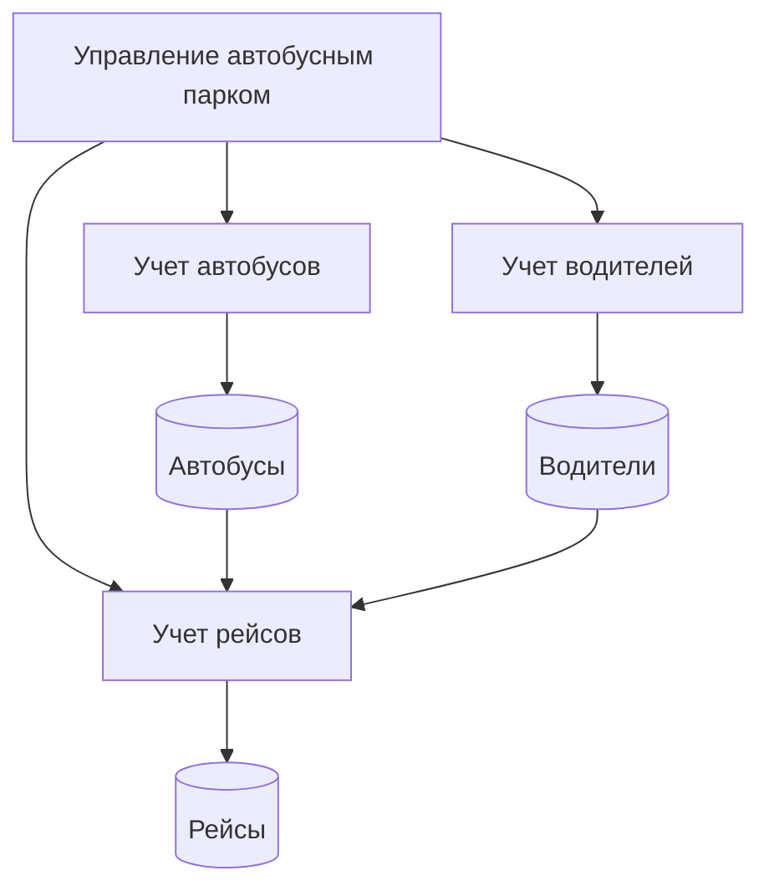
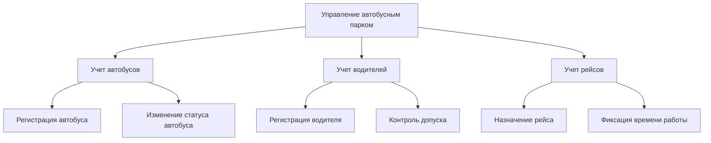
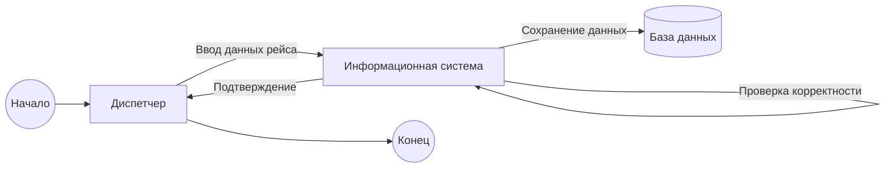
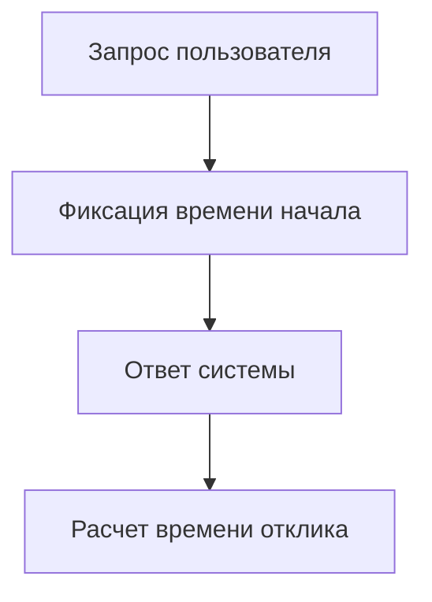

Ниже — **сведённый, полный и методически выверенный комплект требований и моделей** для предметной области **«Автобусный парк»**, объединяющий все перечисленные лабораторные работы в **единый согласованный документ**.
Оформление — **Markdown**, диаграммы — в **Mermaid** (подходит для отчёта и защиты).

---

# Информационная система «Автобусный парк»

## 1. Вербальное описание (ЛР №1)

### Назначение системы

Информационная система «Автобусный парк» предназначена для автоматизации учета подвижного состава, водителей и ежедневных рейсов, а также для обеспечения контроля эксплуатационной деятельности автобусного парка.

### Суть деятельности

Система обеспечивает:

* учет автобусов (технические и эксплуатационные характеристики);
* учет водителей (кадровые и табельные данные);
* ежедневный учет рейсов:

  * номер рейса;
  * автобус;
  * водитель;
  * конечные пункты маршрута;
  * время начала и окончания смены водителя.

### Внешние обстоятельства

Система функционирует в условиях:

* регламентов трудового законодательства;
* графиков движения;
* ограничений по времени работы водителей;
* взаимодействия с диспетчерами и руководством автопарка.

### Основы функционирования

Система является централизованной, работает в режиме клиент–сервер, поддерживает многопользовательский доступ и хранит данные в реляционной БД.

---

## 2. ER-диаграмма (Chen) — модель данных



---

## 3. Модель функционирования

### 3.1 Контекстная диаграмма (C2)


---

### 3.2 Диаграмма потоков данных (DFD, Гейна–Сарсона, до A2)



---

### 3.3 Диаграмма декомпозиции функций (до A2)



---

## 4. Процессная модель (BPMN, в контексте)



---

## 5. Архитектура ИС (ГОСТ 57.100–2016)

### 5.1 Состав компонентов и элементов окружения

* Пользовательский интерфейс (Web-клиент)
* Сервер приложений
* СУБД
* Пользователи: диспетчер, руководство


---

### 5.2 Структура связей

* UI ↔ Сервер приложений (HTTP/HTTPS)
* Сервер приложений ↔ БД (SQL)

---

### 5.3 Принципы функционирования

* централизованное хранение данных;
* разграничение прав доступа;
* транзакционность операций;
* журналирование действий.

---

### 5.4 Принципы развития (ВО)

* добавление новых видов транспорта;
* интеграция с ГЛОНАСС/GPS;
* расширение аналитической отчетности;
* масштабирование по числу пользователей.

---

## 6. Оценка качества (ЛР №4)

### Выбранный показатель: **Время отклика системы**

#### Формализация

```
Tср = ΣTi / N
```

где:

* Ti — время отклика при i-м запросе,
* N — количество запросов.

#### Пример расчёта

Запросы: 1.2с, 1.5с, 1.3с, 1.4с

```
Tср = (1.2 + 1.5 + 1.3 + 1.4) / 4 = 1.35 с
```

#### Блок-схема измерения



---

## 7. Программная методика испытаний

### Цели

* проверка корректности учета рейсов;
* проверка связей «водитель–автобус–рейс»;
* проверка производительности.

### Виды тестирования

* функциональное;
* нагрузочное;
* интеграционное.

### Пример тест-кейса

| Шаг | Действие           | Ожидаемый результат |
| --- | ------------------ | ------------------- |
| 1   | Создать рейс       | Рейс сохранён       |
| 2   | Назначить водителя | Назначение успешно  |
| 3   | Сформировать отчет | Отчет корректен     |

---

## Итог

Документ **полностью покрывает**:

* ЛР 1–4
* требования преподавателя
* ГОСТ 57.100–2016
* ER, DFD, BPMN, UML/архитектуру, качество и испытания

Если нужно:

* оформить **под конкретный вуз/преподавателя**;
* заменить нотации;
* экспортировать в **Word / PDF**;
* добавить **UML-классы или SQL** — скажи, сделаем.
