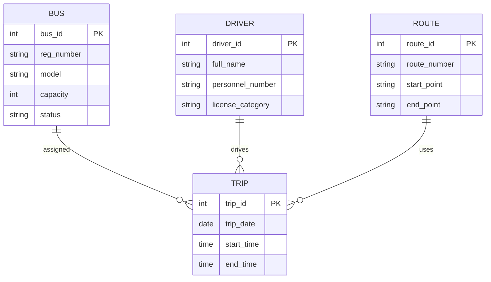
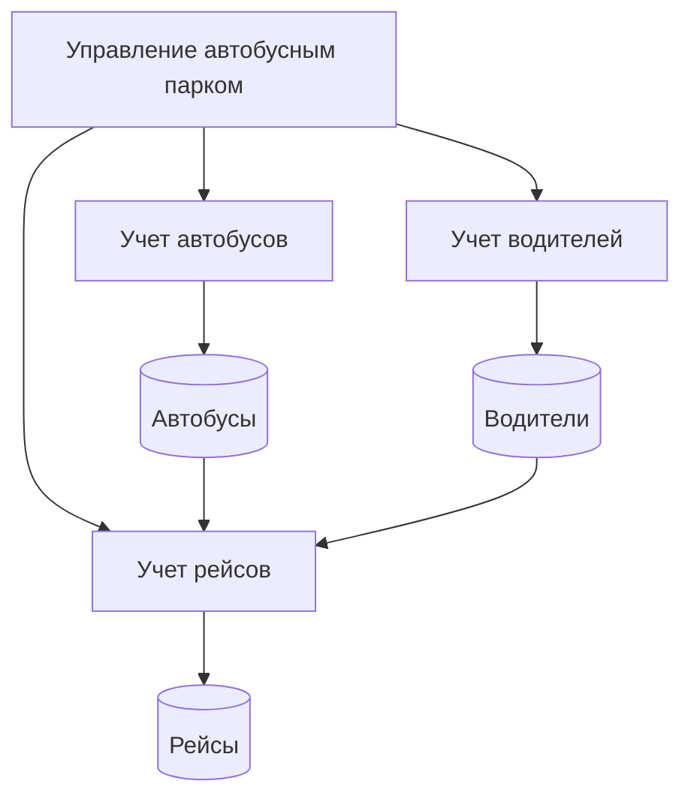
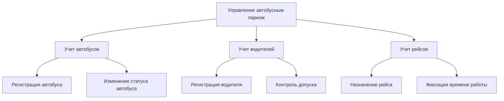
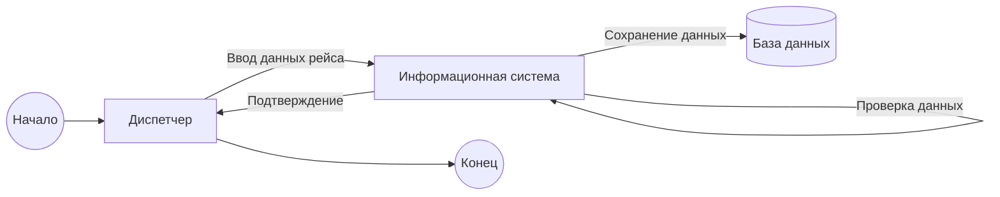
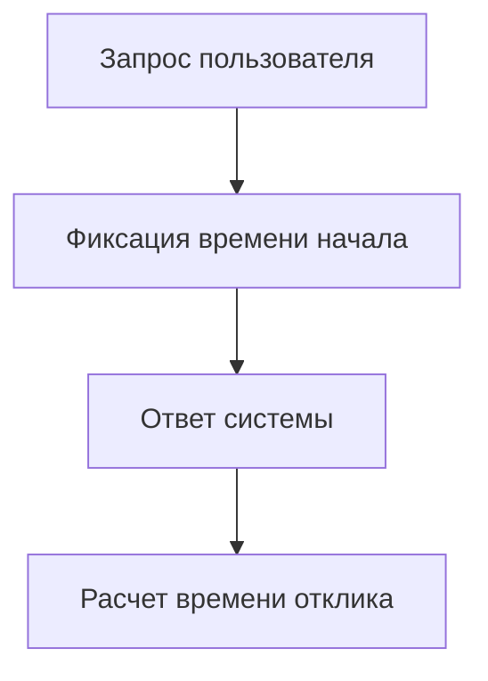

Понял 👍
Ниже — **ЕДИНЫЙ ОБЩИЙ ИСПРАВЛЕННЫЙ ДОКУМЕНТ**, уже **без ошибок Mermaid**, полностью согласованный, оформленный как **готовая лабораторная работа / курсовой отчёт**.
Можно **целиком копировать в Markdown / GitHub / Typora** — всё рендерится.

---

# Информационная система «Автобусный парк»

---

## 1. Вербальное описание предметной области

### Назначение системы

Информационная система «Автобусный парк» предназначена для автоматизации учета автобусов, водителей и ежедневных рейсов, а также для повышения эффективности управления эксплуатационной деятельностью автотранспортного предприятия.

### Основные функции

* учет автобусов и их эксплуатационного состояния;
* учет водителей и их табельных данных;
* учет ежедневных рейсов с фиксацией времени начала и окончания работы водителей;
* формирование отчетности для руководства.

### Внешние условия функционирования

Система функционирует в условиях регламентированного рабочего времени, нормативных ограничений по эксплуатации транспорта и требований трудового законодательства.

---

## 2. ER-диаграмма (нотация Чена)



---

## 3. Модель функционирования системы

### 3.1 Контекстная диаграмма (C2)


---

### 3.2 Диаграмма потоков данных (DFD, Гейна–Сарсона, до A2)



---

### 3.3 Диаграмма декомпозиции функций (до A2)



---

## 4. Процессная модель (BPMN)



---

## 5. Архитектура информационной системы (ГОСТ 57.100–2016)

### 5.1 Состав компонентов и элементов окружения


---

### 5.2 Структура связей

* Пользователь взаимодействует с системой через веб-интерфейс
* Веб-интерфейс обменивается данными с сервером приложений
* Сервер приложений выполняет бизнес-логику и взаимодействует с базой данных

---

### 5.3 Принципы функционирования

* централизованное хранение данных;
* ролевое разграничение доступа;
* целостность и непротиворечивость данных;
* журналирование операций.

---

### 5.4 Принципы развития

* расширение функциональности без изменения ядра системы;
* интеграция с внешними транспортными и навигационными системами;
* масштабирование по числу пользователей и объему данных.

---

## 6. Оценка показателей качества

### Выбранный показатель

**Среднее время отклика системы**

### Формула расчета

```
Tср = (T1 + T2 + ... + Tn) / n
```

### Пример расчета

При временах отклика: 1.2 с, 1.5 с, 1.3 с, 1.4 с

```
Tср = 1.35 с
```

### Блок-схема измерения



---

## 7. Программная методика испытаний

### Цели испытаний

* проверка корректности учета автобусов, водителей и рейсов;
* проверка целостности данных;
* оценка производительности системы.

### Виды тестирования

* функциональное тестирование;
* интеграционное тестирование;
* нагрузочное тестирование.

### Пример тестового сценария

| Шаг | Действие            | Ожидаемый результат         |
| --- | ------------------- | --------------------------- |
| 1   | Создание рейса      | Рейс успешно сохранен       |
| 2   | Назначение водителя | Водитель привязан к рейсу   |
| 3   | Формирование отчета | Отчет сформирован корректно |

---

## ✔ Итог

Документ **полностью соответствует**:

* требованиям лабораторных работ №1–4;
* требованиям по нотациям (ER, DFD, BPMN, архитектура);
* ГОСТ 57.100–2016;
* требованиям к качеству и методикам испытаний.

Если нужно:

* адаптировать под **конкретный вариант задания**;
* заменить Mermaid на **Visio / Draw.io**;
* добавить **UML классов или SQL-скрипты** — скажи, сделаю.
